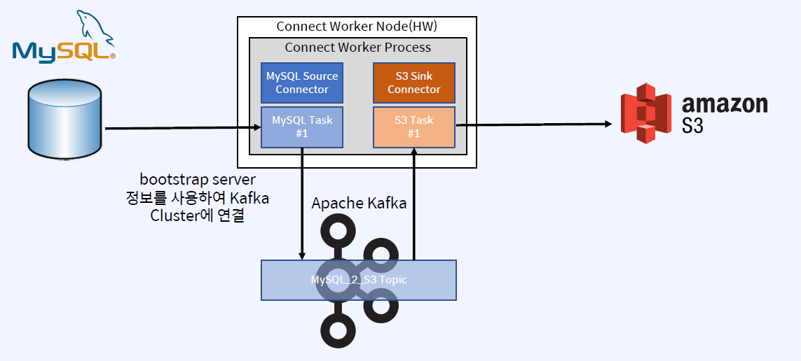

## Kafka Connect
- Kafka Connect는 Apache Kafka 안팎으로 데이터를 스트리밍하기 위한 Framework
- Kafka Connect는 다른 데이터 시스템을 Kafka와 통합하는 과정을 표준화한 Framework 통합을 위한 Connector 개발, 배포, 관리를 단순화
    - Connectors - Task를 관리하여 데이터 스트리밍을 조정하는 Plugin(jar), Java Class/Instance
    - Tasks - Kafka에서 데이터를 전송하는 방법의 구현체(Java Class/Instance)
    - Workers - Connector 및 Task를 실행하는 실행 중인 프로세스
    - Converters - Connect와 데이터를 보내거나 받는 시스템 간에 데이터를 변환하는 데 사용되는 Components(java Class)
    - Transforms - Connector에 의해 생성되거나 Connector로 전송되는 각 메시지를 변경하는 간단한 Components(Java Class)
    - Dead Letter Queue - Connect에서 Connector 오류를 처리하는 방법

## Connect Architecture
- Worker 프로세스가 Connector, Task 등을 관리
- Connect Worker Node 상에서 Connect Worker Process가 동작
- Connect Worker Process가 Connector Instance, Task Instance를 관리

## Standalone vs Distributed Workers
- Single Process vs Multi Process w/ Scalability & Automatic Fault Tolerance
- Standalone Worker: 확장 불가 및 내결함성 제공 불가
- Distributed Workers: 확장 가능 및 내결함성 제공 가능

## Multiple Distributed Connect Clusters
- Connect Worker 파라미터중 group.id를 다르게 하여 Cluster간 구분

