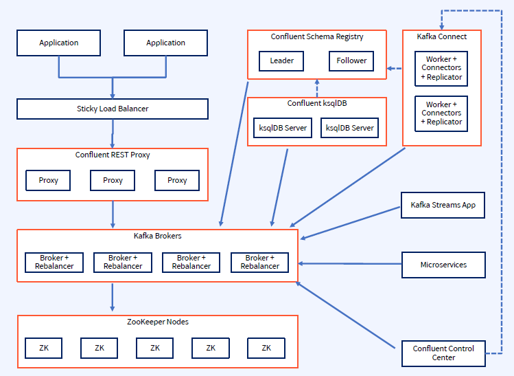
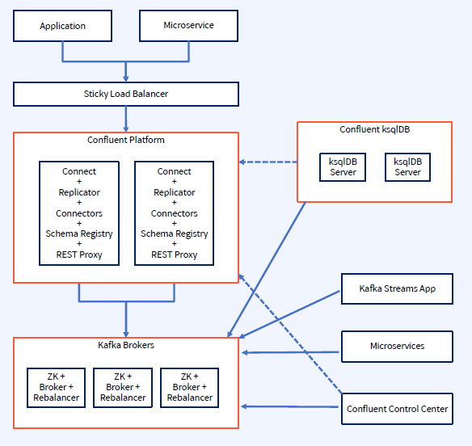

## Large Cluster Reference Architecture
- 높은 처리량의 장기적인 확장성을 위해 구축된 Confluent Platform 클러스터 아키텍처
    - 확장을 고려해서 설계
    - 각 구성 요소는 자체 서비를 기반으로 구성
    - 노드를 추가하여 독립적으로 확장할 수 있음
    - Confluent REST Proxy를 사용하는 애플리케이션을 추가할 때 REST Proxy는 더 이상 필요한 처리량을 제공하지 못하는 반면 기존 Kafka Broker에는 여전히 여유 용량이 있다면, 이 경우 REST Proxy 노드를 추가하여 확장하면 됨

## Small Cluster Reference Architecture
- Confluent Platform의 채택 초기 단계에서 주로 사용하는 아키텍처
    - 대부분 Kafkaㄹ르 처음 도입하는 조직은 부하가 제한된 하나의 사용 사례에 대해 Confluent Platform을 채택하는 것으로 시작
    - 이 채택이 성공적으로 입증되면 조직은 추가 애플리케이션과 팀을 수용할 수 있도록 클러스터를 확장
    - 일반적으로 초기 도입 프로젝트의 성공을 위해 전체 배포에 대한 투자가 필요하지 않은 Confluent Platform 채택의 초기 단계에 이 아키텍처를 권장
    - 이러한 경우 더 적은 수의 서버로 시작하고 서버당 여러 구성 요소를 설치하는 것을 권장
    - Confluent Control Center 및 Confluent ksqlDB와 같은 리소스 집약적 구성 요소에 대해서는 전용 서버를 구성하는 것을 권장

