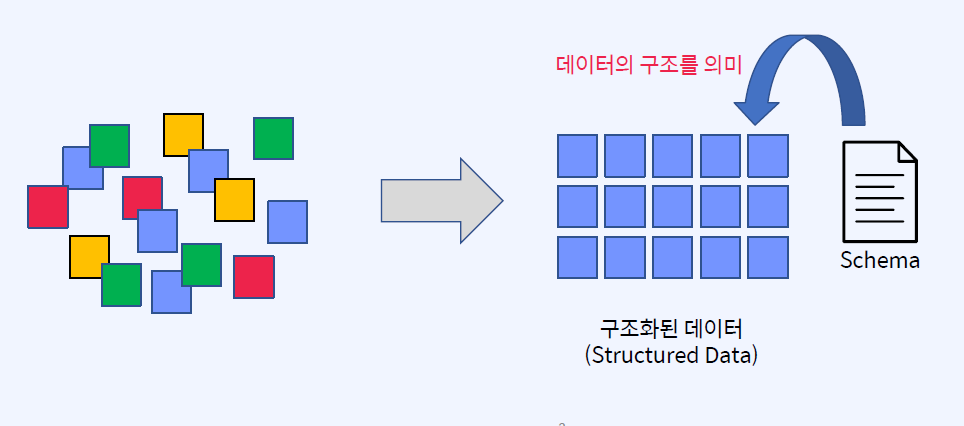
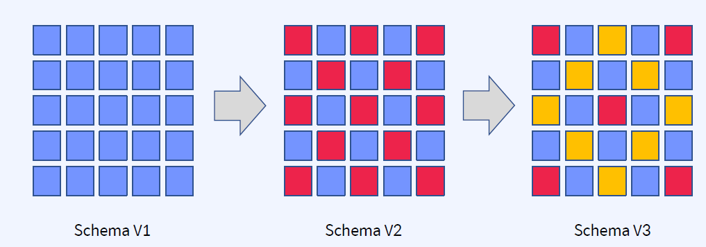
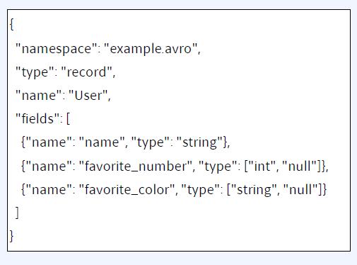
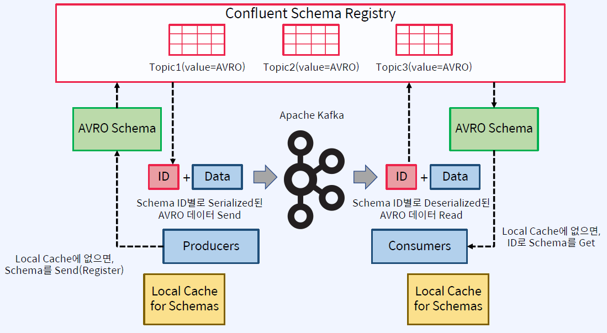

## Multiple Distributed Connect Clusters
- 데이터를 만들어내는 Producer와 데이터를 사용하는 Consumer 간의 계약으로 사용
    - 스키마가 없으면 시간이 지남에 따라, 제어된 방식으로 데이터 구조를 발전시킬 수단이 없게 됨
    - 데이터 구조는 항상 비즈니스에 따라서 진화하는데, 이것을 Schema Evolution라고 함

## Schema Evolution
- 비즈니스가 변경되거나 더 많은 애플리케이션이 동일한 데이터를 활용하기를 원함에 따라 기존 데이터 구조가 진화할 필요성 발생

Backward Compatibility: 새로운 스키마를 사용하여 이전 데이터를 읽는 것이 가능한 것을 의미
Forward Compatibility: 이전 스키마를 사용하여 새로운 데이터를 읽는 것이 가능한 것을 의미
Full Compatibility: 양쪽이 다 가능

## AVRO
- Data Serialization System
- Java를 포함한 많은 프로그래밍 언어에서 지원
- 데이터 구조 형식 제공
- Avro 데이터는 바이너리이므로 데이터를 효율적으로 저장

1. 장점
    - 압축, 고성능, Binary 포맷
    - Java를 포함한 많은 프로그래밍 언어에서 지원
    - Avro 데이터가 파일에 저장되면 해당 스키마가 함께 저장되므로 나중에 모든 프로그램에서 파일 처리 가능
    - Avro 스키마는 JSON으로 정의되므로, 이미 JSON 라이브러리가 있는 언어에서 구현이 용이(Schema Evolution을 쉽게 지원)
    - 데이터의 타입을 알 수 있음
    - Confluent Schema Registry에서 사용 가능
2. 단점
    - Binary 형태로 Serialization되기 때문에 데이터를 쉽게 보고 해석하기 어려움(디버깅, 개발시 불편함)

## Schema 설계시 고려할 점
- 삭제될 가능성이 있는 필드이면 default value를 반드시 지정
- 추가되는 필드라면 default value를 지정
- 필드의 이름을 변경하지 않음

## Confluent Schema Registry
- Confluent Schema Registry는 스키마의 중앙 집중식 관리를 제공
    - 모든 스키마의 버전 기록을 저장
    - Avro 스키마 저장 및 검색을 위한 RESTful 인터페이스 제공
    - 스키마를 확인하고 데이터가 스키마와 일치하지 않으면 예외를 throw
    - 호환성 설정에 따라 Schema Evolution 가능
- 각 메시지와 함께 Avro 스키마를 보내는 것은 비효율적
    - 대신 Avro 스키마를 나타내는 Global Unique ID가 각 메시지와 함께 전송
- Schema Registry는 특별한 Kafka Topic에 스키마 정보를 저장
    - "_schemas"  Topic (internal topic)
    - kafkastore.topic 파라미터로 변경 가능

## Schema 등록 및 Data Flow

