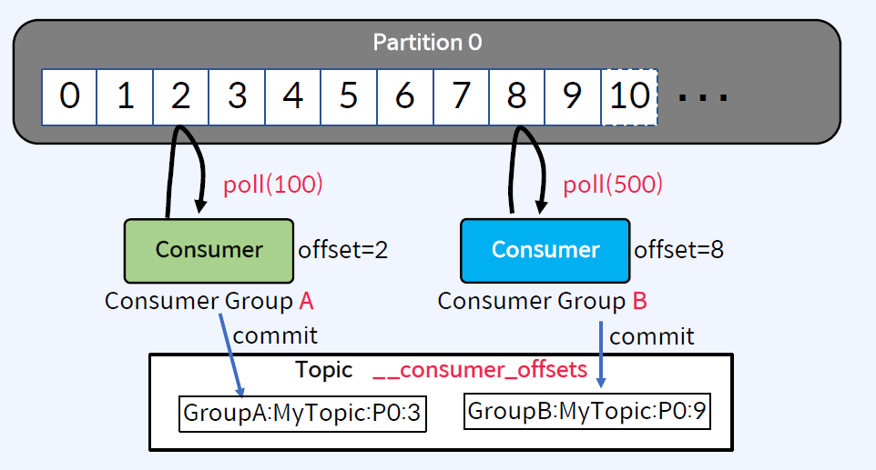
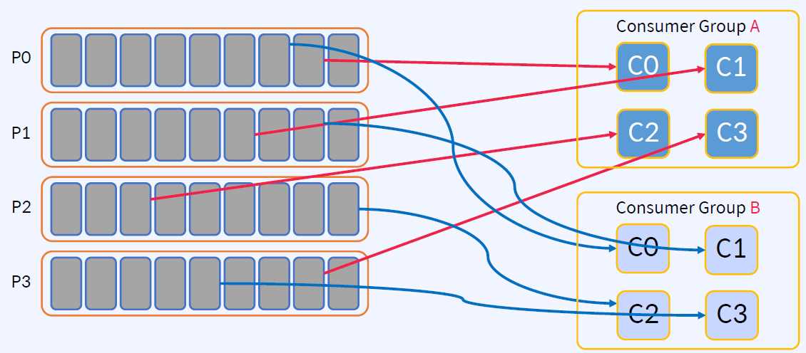
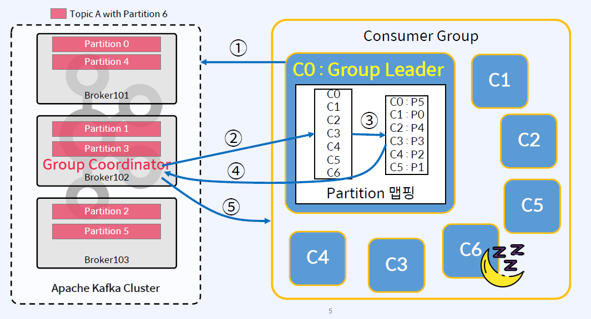
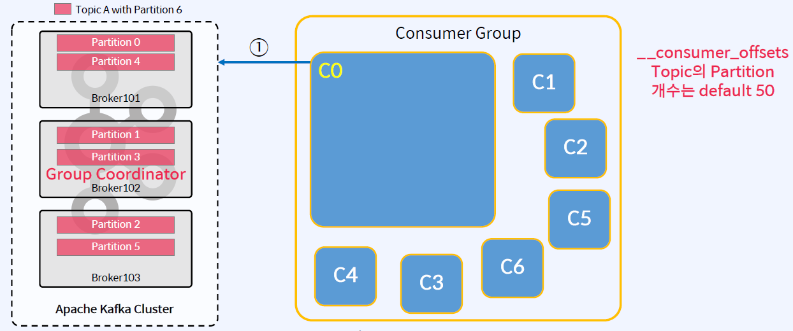
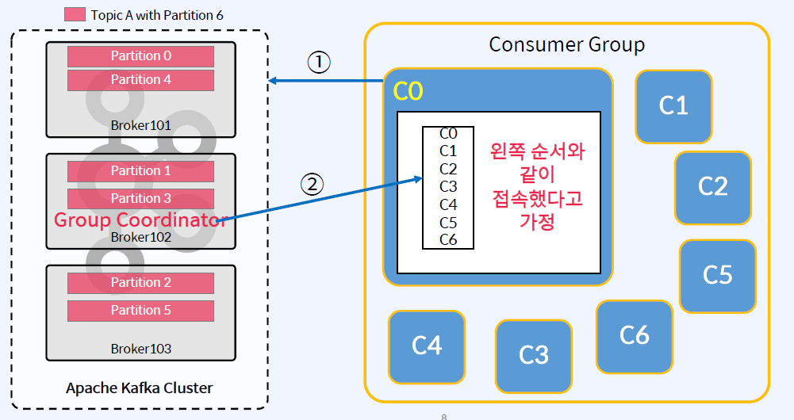
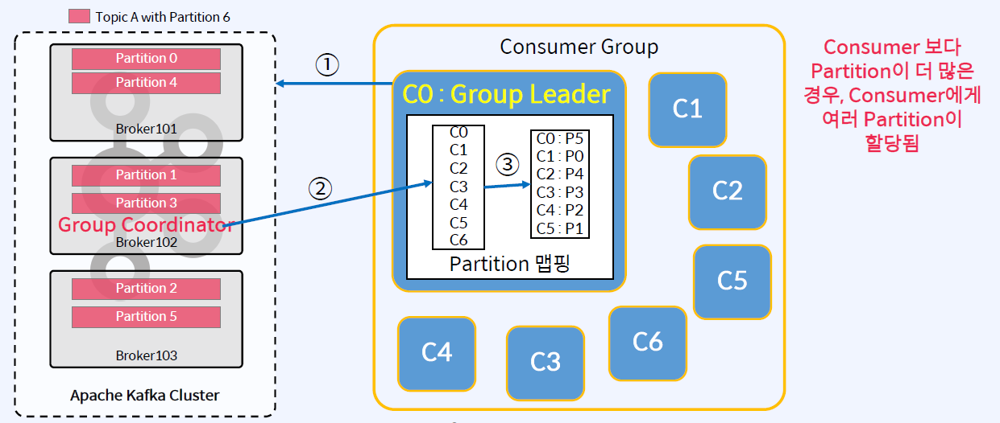
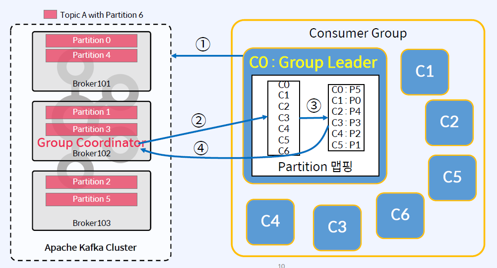
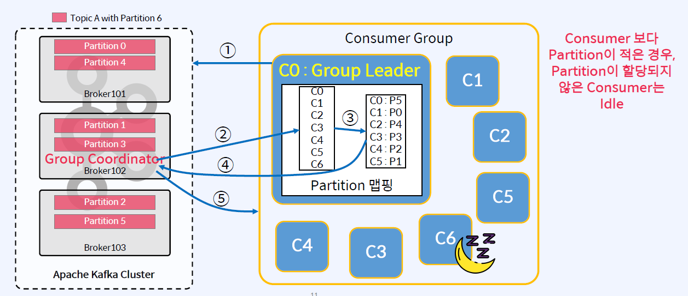

## Consumer의 동작 방식
- Consumer는 메시지를 가져오기 위해서 Partition에 연속적으로 Poll함
- 가져온 위치를 나타내는 offset 정보를 __consumer_offsets Topic에 저장하여 관리

## Consumer Load Balancing
- 동일한 group.id로 구성된 모든 Consumer들은 하나의 Consumer Group을 형성
- Consumer Group의 Consumer들은 작업량을 어느 정도 균등하게 분할함
- 동일한 Topic에서 consume하는 여러 Consumer Group이 있을 수 있음

다른 Consumer Group의 Consumer는 분리되어 독립적으로 작동

## Partition Assignment
하나의 Consumer Group에서의 Partition 할당
- Partition을 Consumer에게 Assign(할당) 할 때
    - 하나의 Partition은 지정된 Consumer Group 내의 하나의 Consumer만 사용
    - 동일한 Key를 가진 메시지는 동일한 Consumer가 사용(Partition 수를 변경하지 않는 한)
    - Consumer의 설정 파라미터 중에서 partition.assignment.strategy로 할당 방식 조정
    - Consumer Group은 Group Coordinator라는 프로세스에 의해 관리됨

## Consumer Group Coordination

- Group Coordinator(하나의 Broker)와 Group Leader(하나의 Consumer)가 상호작용

## Consumer Group을 등록하고 Consumer 전체에 Partition을 할당하는 프로세스
1. Consumer 등록 및 Group Coordinator 선택
- 각 Conumer는 group.id로 kafka 클러스터에 자신을 등록
- kafka는 Consumer Group을 만들고 Consumer의 모든 Offset은 __consumer_offsets Topic의 하나의 Partition에 저장
- 이 Partition의 Leader Broker는 Consumer Group의 Group Coordginator로 선택

- hash(group.id) % offsets.topic.num.partitions 수식을 사용하여 group.id가 저장될 __consumer_offsets의 Partition을 결정

2. JoinGroup  요청 순서에 따라 Consumer 나열
- Group Coordinator는 Group의 Conusmers 카탈로그를 생성하기 전에 Consumers의 JoinGroup 요청에 대해 group.initial.rebalance.delay.ms(기본값 3초) 대기
- Consumer들이 Consum할 최대 Partition 수까지 JoinGroup 요청을 수신하는 순서대로 Consumer를 나열

3. Group Leader 결정 및 Partition 할당
- JoinGroup 요청을 보내는 최초 Consumer는 Group Leader로 지정되며, Group Coordinator로부터 Consumer 목록을 받음
- Group Leader는 구성된 partition.assignment.strategy를 사용하여 각 Consumer에게 Partition을 할당
- 아래 그림에선s Partition보다 더 많은 Consumer가 있으므로 각 Consumer는 Consume할 Partition이 최대 1개 있음

4. "Consumer -> Partition" 매핑정보를 Group Coordinator에게 전송
- Group Leader는 "Consumer -> Partition" 맵핑정보를 Group Coordinator에게 다시 보냄
- Group Coordiantor는 맵핑정보를 메모리에 캐시하고 Zookeeper에 유지

5. 각 Consumer에게 할당된 Partition 정보를 보냄
- Group Coordinator는 각 Consumer에게 할당된 Partiton 정보를 보냄
- 각 Consumer는 할당된 Partition에서 Consume을 시작

## 왜 Group Coordinator(a Broker)가 직접 Partition을 할당하지 않는가?
- Kafka의 한 가지 원칙을 가능한 한 많은 계산을 클라이언트에 수행하도록 하여, Broker의 부담을 줄이는 것
- 많은 Consumer Group과 Consumer들이 있고 Broker 혼자서 Rebalance를 위한 계산을 한다고 생각해보면
-> Broker에 엄청난 부담
-> 이러한 계산을 Broker가 아닌 클라이언트에게 오프로드(Offload)하는 것이 가장 바람직함

## Consumer Rebalancing Trigger
불필요한 Rebalancing은 피해야 함
- Rebalancing Trigger
    - Consumer가 Consumer Group에서 탈퇴
    - 신규 Consumer가 Consumer Group에 합류
    - Consumer가 Topic 구독을 변경
    - Consumer Group은 Topic 메타데이터의 변경 사항을 인지 (ex) Partition 증가)
- Rebalancing Process
    1. Group Coordinator는 hartbeats의 플래그를 사용하여 Consumer에게 Rebalance 신호를 보냄
    2. Consumer가 일시 중지하고 Offset을 Commit
    3. Consumer는 Consumer Group의 새로운 "Generation"에 다시 합류
    4. Partition 재할당
    5. Consumer는 새 Partition에서 다시 Consume을 시작
- Consumer Rebalancing시 Consumer들은 메시지를 Consume하지 못함. 따라서 불필요한 Rebalancing은 반드시 피해야 함

## Consumer Heartbeats
Consumer 장애를 인지하기 위함
- Consumer는 poll()과 별도로 백그라운드 Thread에서 Heartbeats를 보냄
    - heartbeat.interval.ms(기본값 3초)
- 아래 기간 동안 Heartbeats가 수신되지 않으면 Consumer는 Consumer Group에서 삭제
    - session.timeout.ms(기본값 10초)
- poll()은 Heartbeats와 상관없이 주기적으로 호출되어야 함
    - max.poll.interval.ms(기본값 5초)

## 과도한 Rebalancing을 피하는 방법(성능 적화에 필수)

1. Conumer Group 멤버 고정
    - Group의 각 Consumer에게 고유한 group.instance.id를 할당
    - Consumer는 LeaveGroupRequest를 사용하지 않아야 함
    - Rejoin(재가입)은 알려진 group.instance.id에 대한 Rebalance를 trigger하지 않음
2. session.timeout.ms 튜닝
    - heartbeat.interval.ms를 session.timeout.ms 1/3로 설정
    - group.min.session.timeout.ms(Default:    6 sec)와 group.max.session.timeout.ms(Default: 5sec) 의 사이 값
    - 장점: Consumer가 Rejoin할 수 있는 더 많은 시간을 제공
    - Consum 장애를 감지하는데 시간이 더 오래 걸림
3. max.poll.interval.ms 튜닝
    - Consumer에게 poll()한 데이터를 처리할 수 있는 충반한 시간 제공
    - 너무 크게 하면 안됨

## Summmary
Partition Assignment, Consumer Rebalancing
- Consumer의 파라미터인 partition.assignment.stratgy로 Partition 할당 방식 조정
- Consumer Rebalancing의 Trigger 조건들
- 과도한 Consumer Rebalancing을 피해야 함