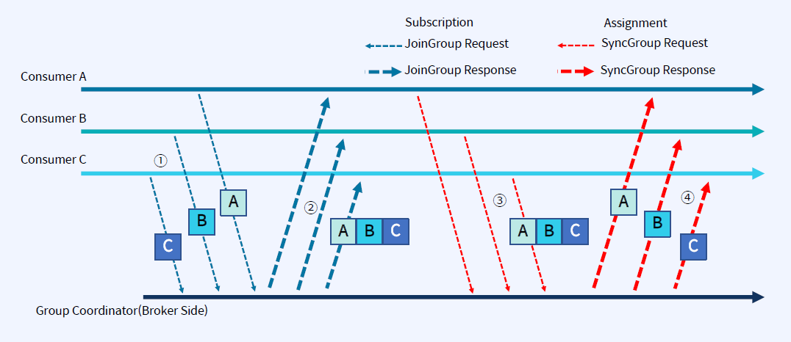
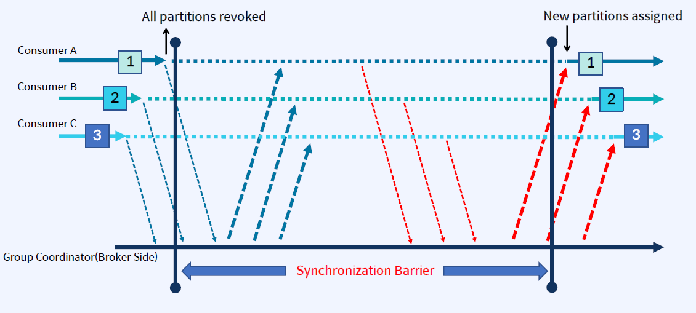
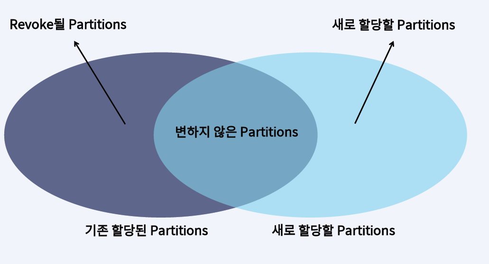
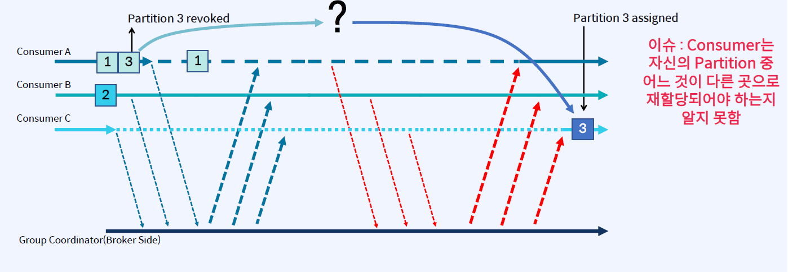

## Consumer Rebalancing Process
- 시간 흐름에 따른 Consumer Rebalance 과정
1. Consumer들이 JoinGroup 요청을 Group Coordinator(Broker)에 보내면서 리벨런싱 시작
2. JoinGroup의 응답이 Consumer들에게 전송(Group Leader는 Consumer들 정보를 수신)
3. 모든 구성원은 Broker에 SyncGroup 요청을 보내야 함(Group Leader는 각 Consumer의 Partition 할당을 계산해서 Group Coordinator에게 전송)
4. Broker는 SyncGroup 응답에서 각 Consumer별 Partition 할당을 보냄

## Eager Rebalancing 프로토콜 (지금까지 사용되었던 방식)
- Eager Rebalancing 프로토콜은 최대한 단순하게 유지하기 위해 만들어짐
    - 각 구성원은 JoinGroup 요청을 보내고 재조정에 참여하기 전에 소유한 모든 Partition을 취소해야 함
    - 안전면에서는 좋지만 "Stop-the-World" 프로토콜은 그룹의 구성원이 재조정 기간 동안 작업을 수행할 수 없는 단점이 존재

## Incremental Cooperative Rebalancing Protocol (이전 Eager Rebalancing 프로토콜 보다 발전한 방식)

- Revoke 할 Partition만 Revoke 하자

## Incremental Cooperative Rebalancing Protocol (이상적은 Consumer Rebalancing 프로토콜)
- Consumer A, B가 Consume하고 있는 상태에서 처리량을 늘이기 위해서 Consumer C를 추가하는 경우를 가정
    - Consumer A에 할당된 Partition중 하나만 Consumer C로 이동하는 것이 가장 이상적임
    - 전체 재조정 동안 모두 정지 상태로 있는 대신, Consumer A만 하나의 Partition을 취소하는 동안만 가동 중지

## Cooperative Sticky Assignor
- Rebalancing을 두 번 수행
    - JoinGroup 요청을 보내면서 시작하지만, 소유한 모든 Partition을 보유하고, 그 정보를 Group Coordinator에게 보냄
    - Group Leader는 원하는 대로 Consumer에게 Partition을 할당하지만, 소유권을 이전하는 Partition들만 취소함
    - Partition을 취소한 구성원은 그룹에 ReJoin하여 취소된 Partition을 할당할 수 있도록 두 번째 재조정을 트리거

