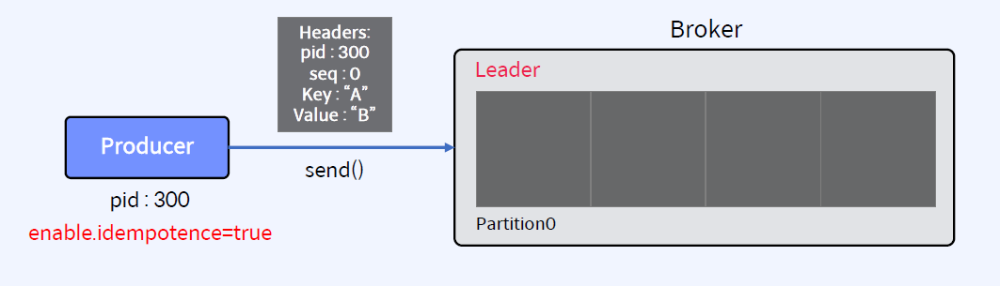
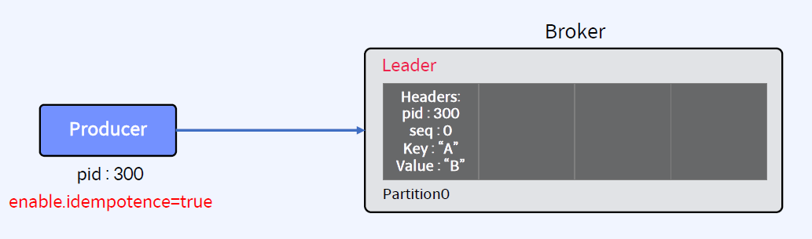

## Delivery Semantics
- At-Most-Once Semantics(최대 한 번)
    - 확인 시간이 초과되거나 오류가 반환될 때 Producer가 재시도하지 않으면, 메시지가 Kafka Topic에 기록되지 않아 Consumer에게 전달되지 않을 수 있음
    - 중복 가능성을 피하기 위해 때때로 메시지가 전달되지 않을 수 있음을 허용
- At-Least-Once Semantics(최소 한 번)
    - Producer가 Kafka Broker로부터 ack를 수신하고 acks-all이면 메시지가 Kafka Topuc에 최소 한 번 작성되었음을 의미함
    - 그러나 ack가 시간 초과되거나 오류를 수신하면 메시지가 Kafka Topic에 기록되지 않았다고 가정하고 메시지 전송을 다시 시도할 수 있음
    - Broker가 ack를 보내기 직전에 실패했지만 메시지가 Kafka Topic에 성공적으로 기록된 후에 이 재시도를 수행하면 메시지가 두 번 기록되어 최종 Consumer에게 두 번 이상 전달되어 중복 작업과 같은 잘못된 결과로 이어 질 수 있음
- Exactly-Once Semantics(정확히 한 번)
    - Producer가 메시지 전송을 다시 시도하더라도 메시지가 최종 Consumer에게 정확히 한 번 전달됨
    - 메시징 시스템 자체와 메시지를 생성하고 소비하는 어플리케이션 간의 협력이 반드시 필요함
    - 예를 들어, 메시지를 성공적으로 사용한 후 Kafka Consumer를 이전 Offset으로 되감으면 해당 Offset에서 최신 Offset까지 모든 메시지를 다시 수신하게 됨

## Exactly Once Semantics(EOS)의 필요성

- 데이터가 정확히 한 번 처리되도록 보장해야 하는 실시간 미션 크리티컬 스트리밍 Application
    - 클라이언트(Idempotent Producer)에서 생성되는 중복 메시지 방지
    - Transaction 기능을 사용하여, 하나의 트랜잭션내의 모든 메시지가 모두 Write 되었는지 또는 전혀 Write되지 않았는지 확인 (Atomic Message)
- Use Cases
    - 금융 거래 처리 - 송금, 카드 결제 등
    - 과금 정산을 위한 광고 조회수 추적
    - Billing 서비스간 메시지 전송

- Java 클라이언트에서만 Fully Supported (AK 0.11.0 부터)
    - Pruducer, Consumer
    - Kafka Connect
    - Kafka Streams API
    - Confluent REST proxy
    - Confluent ksqlDB
- Transaction Coordiantor 사용
    - 특별한 Transaction Log를 관리하는 Broker Thread (Commit or Rollback 결정)
    - 일련의 ID 번호(Producer ID, Sequence Number, Transaction ID)를 할당하고 클라이언트가 이 정보를 메시지 Header에 포함하여 메시지를 고유하게 식별 (Producer ID, Sequence Number는 알아서 할당된다. Transaction ID는 개발 시에 직접 해줘야 한다)
    - Sequence Number는 Broker가 중복된 메시지를 Skip할 수 있게 함

## Exactly Once Semantics 관련 파라미터
- Idempotent Producer
    - Producer의 파라미터중 enable.idempotence를 true로 설정
    - Producer가 Retry(재시도)를 하더라도, 메시지 중복을 방지
    - 성능에 영향이 별로 없음
- Transaction (성능에 영향이 있음)
    - 각 Producer에 고유한 transactional.id를 설정
    - Producer를 Transaction API를 사용하여 개발
    - Consumer에서 isolation.level을 read_committed로 설정
- Broker의 파라미터는 Transaction을 위한 Default 값이 적용되어 있음(필요시에만 수정 필요)

## Idempotent Producer 메시지 전송 프로세스
- 각 Producer는 고유한 Producer ID를 사용하여 메시지 송신
- 메시지는 Sequence Number와 고유한 Producer ID를 가지고 있음

- Broker는 메모리에 map {Producer ID: Sequence Number}를 저장
- 이 map은 *.snapshot 파일로 저장

- Broker가 ack를 못 보낸 경우를 가정
- Producer는 ack를 받지 못했으므로, 동일한 메시지에 대한 재시도(retries)를 수행
- enable.idempotence=true 설정을 하지 않았다면, Broker의 메시지 중복 수신이 불가피

- Broker가 체크하여 메시지가 중복된 것을 확인
- 메시지를 저장하지 않고, Producer에게 DUP response를 리턴

