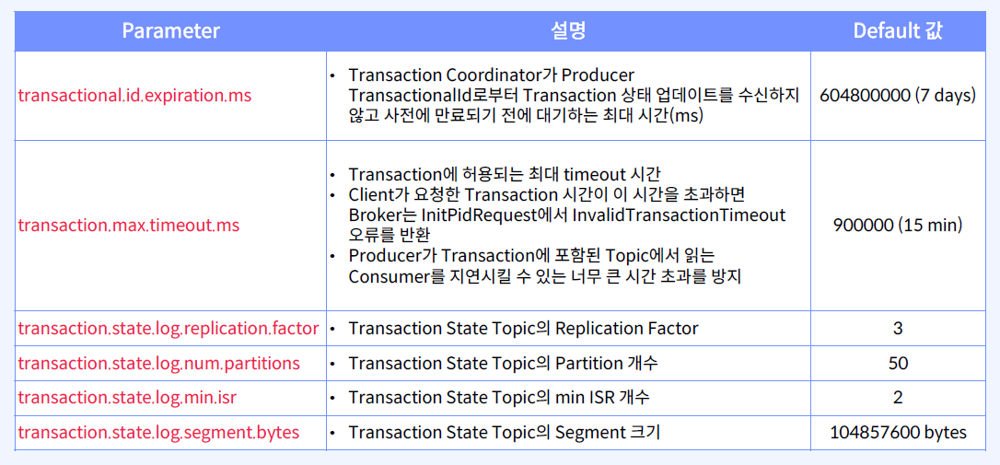
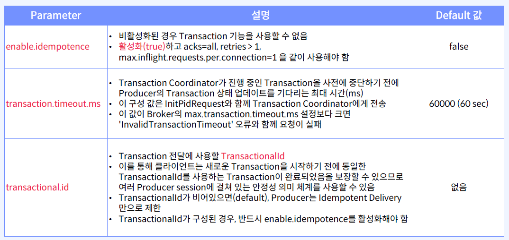
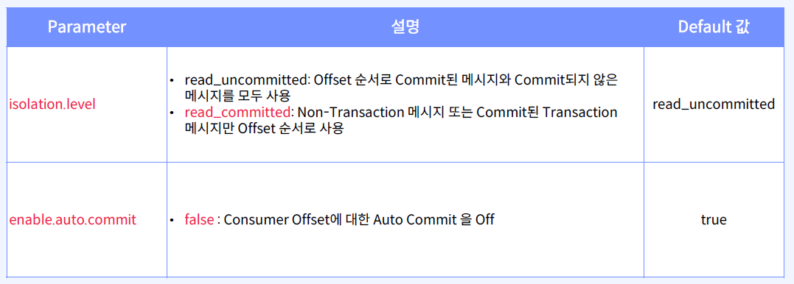
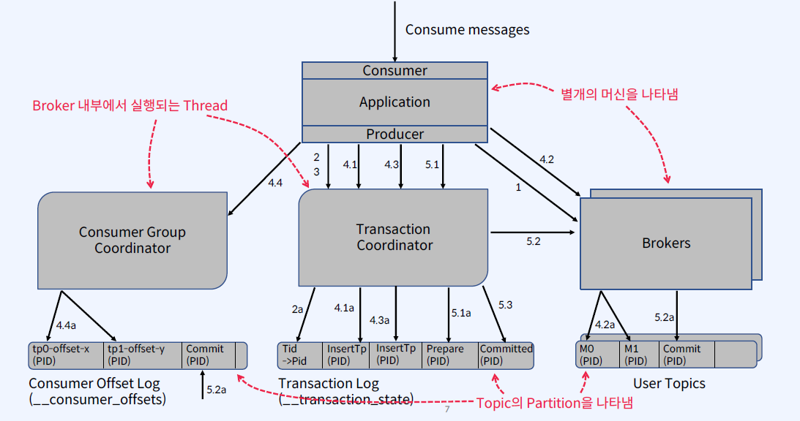

## Transaction
- Transaction을 구현하기 위해, 몇 가지 새로운 개념들이 도입
    - Transaction Coordinator: Consumer Group Coordiantor와 비슷하게, 각 Producer에게는 Transaction Coordinator가 할당되며, PID 할당 및 Transaction 관리의 모든 로직을 수행
    - Transaction Log: 새로운 Internal Kafka Topic으로써, Consumer Offset Topic과 유사하게, 모든 Transaction의 영구적이고 복제된 Record를 저장하는 Transaction Coordinator의 상태 저장소
    - TransactionalId: Producer를 고유하게 식별하기 위해 사용되며, 동일한 TransactionId를 가진 Producer의 다른 인스턴스들은 이전 인스턴스에 의해 만들어진 모든 Transaction을 재개(또는 중단) 할 수 있음

## Transaction 관련 파라미터
- Broker Configs

- Producer Configs

- Consumer Configs

- Consumer가 중복해서 데이터 처리하는 것에 대해 보장하지 않으므로, Consumer의 중복처리는 따로 로직을 작성해야 함(Idempotent Consumer)
- 예를 들어, 메시지를 성공적으로 사용한 후 Kafka Consumer를 이전 Offset으로 되감으면 해당 Offset에서 최신 Offset까지 모든 메시지를 다시 수신하게 됨

## Transaction Data Flow 
1. Transactions Coordinator 찾기
    - Producer가 initTransactions()를 호출하여 Broker에게 FindCoordiantorRequest를 보내서 Transaction Coordinator의 위치를 찾음
    - Transcation Coordiantor는 PID를 할당
2. Producer ID 얻기
    - Prdocuer가 Transaction Coordinator에게 InitPidRequest를 보내서(TransactionlId를 전달) Producer의 PID를 가져옴
    - PID의 Epoch를 높여 Producer의 이전 Zombie 인스턴스가 차단되고 Transaction을 진행할 수 없도록 함
    - 해당 PID에 대한 매핑이 2a단계에서 Transaction Log에 기록

