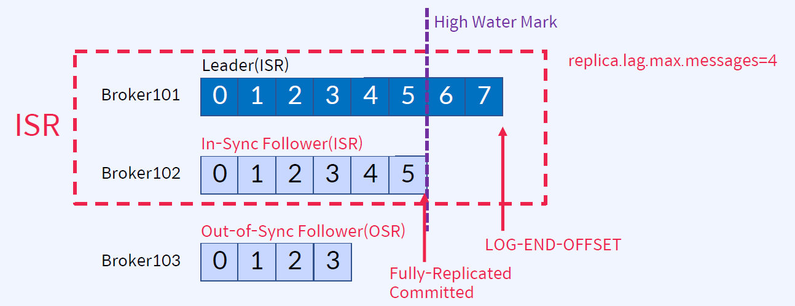
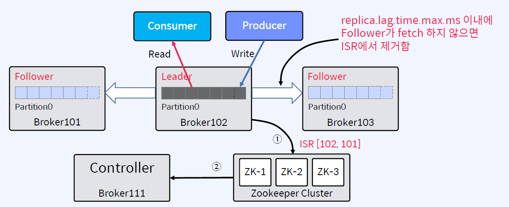
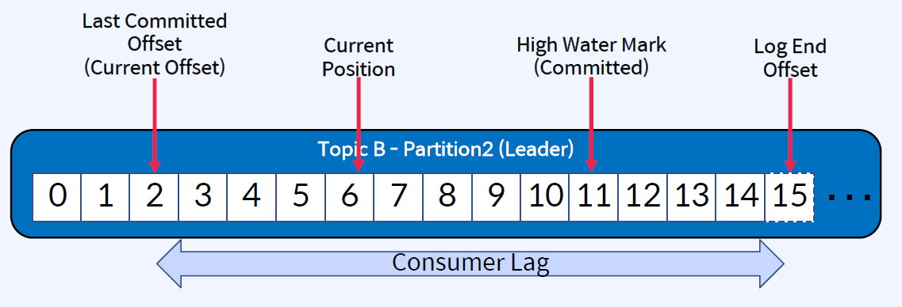
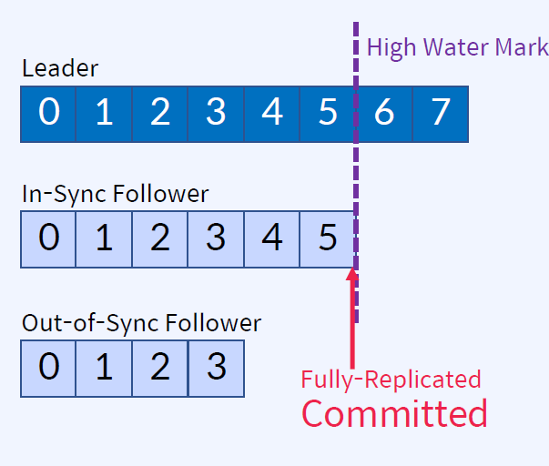
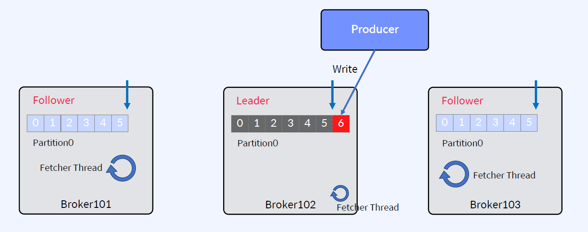
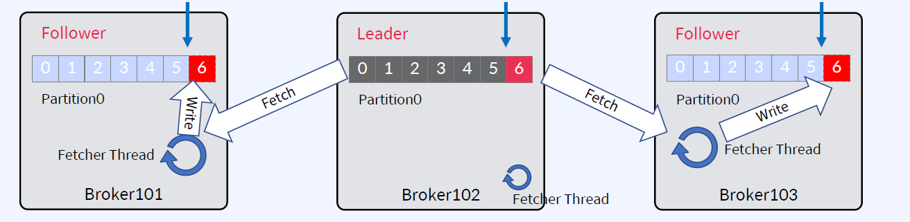
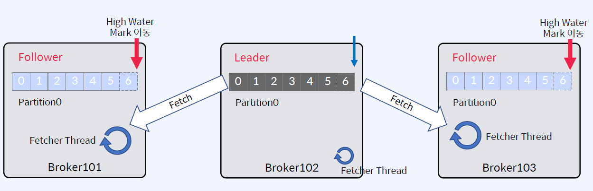

## In-Sync Replicas(ISR)
Leader 장애시 Leader를 선출하는데 사용

 - replica.lag.messages=4 이기 때문에 Broker103은 ISR에 포함이 안됨
 - Leader가 가장 많은 데이터를 가지고 있음, ISR이 있어도 데이터 손실은 일어남

 ## replica.lag.messages의 문제점
 메시지 유입량이 갑자기 늘어날 경우

 > replica.lag.messages로 ISR 판단시 나타날 수 있는 문제점
 - 메시지가 항상 일정한 비율(초당 유입되는 메시지, 3msg/sec 이하)로 kafka로 들어올 때, replica.lag.max.messages-5로 하면 5개 이상으로 지연되는 경우가 없으므로 ISR들이 정상적으로 동장
 - 메시지 유입량이 갑자기 늘어날 경우(ex)초당 10msg/sec), 지연으로 판단하고 OSR(Out-of-Sync Replica)로 상태를 변경시킴
 - 실제 Follower는 정상적으로 동작하고 단지 잠깐 지연만 발생했을 뿐인데, replica.lag.messages 옵션을 사용하면 OSR로 판단하게 되는 문제가 발생(운영중에 불필요한 error 발생 및 그로 인한 불필요한 retry 유발)

 > replica.lag.time.max.ms로 판단해야함
 - Follower가 Leader로 Fetch 요청을 보내는 Interval을 체크
 - ex) replica.lag.time.max.ms = 10000이라면 Follower가 Leader로 Fetch 요청을 10000ms 내에만 요청하면 정상으로 판단
 - Confluent에서는 replica.lag.time.max.ms 옵션만 제공(복잡성 제거)

## ISR은 Leader가 관리
Zookeeper에 ISR업데이트, Controller가 Zookeeper로부터 수신

1. Follower가 너무 느리면 Leader는 ISR에서 Follower를 제거하고 Zookeeper에 ISR을 유지
2. Controller는 Partition Metadata에 대한 변경 사항에 대해서 Zookeeper로부터 수신

## Controller
- Kafka Cluster 내의 Broker중 하나가 Controller가 됨
- Controller는 Zookeeper를 통해 Broker Liveness를 모니터링
- Controller는 Leader와 Replica 정보를 Cluster내의 다른 Broker들에게 전달
- Zookeeper에 Replicas 정보의 복사본을 유지한 다음 더 빠른 엑세스를 위해 클러스터의 모든 Broker들에게 동일한 정보를 캐시함
- Leader 장애시 Leader Election을 수행
- Controller가 장애가 나면 다른 Active Broker등 중에서 재선출

## Consumer 관련 Position들
- Last Committed Offset(Current Offset): Consumer가 최종 Commit한 Offset
- Current Position: Consumer가 읽어간 위치(처리 중, Commit 전)
- High Water Mark(Committed): ISR(Leader-Follower) 간에 복제된 Offset (Consumer가 Commit하는거랑 별개)
- Log End Offset: Producer가 메시지를 보내서 저장된, 로그의 맨 끝

## Committed의 의미 
- ISR 목록은 모든 Replicas가 메시지를 성공적으로 가져오면 'Committed'
- Consumer는 Committed 메시지만 읽을 수 있음(High Water Mark부분)
- Leader는 메시지를 Commit할 시기를 결정
- Committed 메시지는 모든 Follower에서 동일한 Offset을 갖도록 보장
- 즉, 어떤 Replica가 Leader인지에 관계없이(장애가 발생하더라도) 모든 Consumer는 해당 Offset에서 같은 데이터를 볼 수 있음
- Broker가 다시 시작할 때 Committed 메시지 목록을 유지하도록 하기 위해, Broker의 모든 Partition에 대한 마지막 Committed Offset은 replication-offset-checkpoint라는 파일에 기록

## Replicas 동기화
### High Water Mark
- 가장 최근에 Committed 메시지의 Offset 추적
- replication-offset-checkpoint 파일에 체크포인트를 기록

### Leader Epoch
- 새 Leader가 선출된 시점을 Offset으로 표시
- Broker 복구 중에 메시지를 체크포인트로 자른 다음 현재 Leader를 따르기 위해 사용
- Controller가 새 Leader를 선택하면 Leader Epoch를 업데이트하고 해당 정보를 ISR 목록의 모든 구성원에게 보냄
- leader-epoch-checkpoint 파일에 체크포인트를 기록

## Message Commit 과정
Follower에서 Leader로 Fetch만 수행

Fetcher  Thread: 모든 브로커에 존재. Leader에서 주기적으로 Fetcher해서 데이터를 가져옴

1. Offset 5까지 복제가 완료되어 있는 상황에서, Producer가 메시지를 보내면 Leader가 offset 6에 새 메시지를 추가

2. 각 Follower들의 Fetcher Thread가 독립적으로 fetch를 수행하고, 가져온 메시지를 offset 6에 메시지를 Write

3. 각 Follower들의 Fetcher Thread가 독립적으로 다시 fetch를 수행하고 null을 받음. Leader는 High Water Mark 이동 / 각 Follower들의 Fetcher Thread가 독립적으로 다시 fetch를 수행하고 High Water Mark를 받음

## Summary
ISR, Committed, High Water Mark, Controller
- In-Sync Replicas(ISR)는High Water Mark라고 하는 지점까지 동일한 Replicas(Leader와 Follower 모두)의 목록
- High Water Mark(Committed): ISR(Leader-Follower)간에복제된Offset
- Consumer는 Committed 메시지만 읽을 수 있음
- Kafka Cluster 내의 Broker중 하나가 Controller가 됨
- Controller는 ZooKeeper를 통해 Broker Liveness를 모니터링