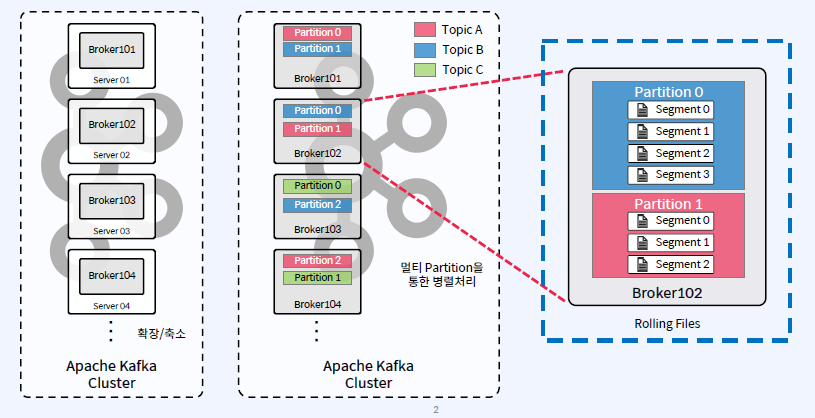

## Topic, Partition, Segment
- Physical View
    - Partition은 Broker들에게 분산되며, 각 Partition은 Segment File들로 구성
    - Rolling Strategy: log.segment.bytes(default 1GB), log.roll.hours(default 168 hours)

## Kafka Log Segment File Directory
- 각 Broker의 log.dirs 파라미터로 정의
- Kafka Log Segment File은 Data File이라고 부르기도 함
- Segment File이 생성되는 위치는 각 Broker의 server.properties 파일 안에서 log.dirs 파라미터로 정의(comma로 구분하여 여러 디렉토리 지정 가능)
- ex) log.dirs=/data/kafka/kafka-log-a,/data/kafka/kafka-log-b,/data/kafka/kafka-log-c
- 각 Topic과 그 Partition은 log.dirs 아래에 하위 디렉토리로 구성됨
- 예로, test_topic의 partition 0은 /data/kafka/kafka-log-a/test_topic-0 디렉토리로 생성

## Partition 디렉토리 안의 Log File들
- 파일명에 의미가 있음

## Partition 디렉토리에 생성되는 파일들의 타입
- 확장자 혹은 파일명으로 구분
- Partition 디렉토리에 생성되는 Files Types은 최소 4가지
    - Log Segment File - 메시지와 metadata를 저장 --> .log
    - Index File - 각 메시지의 Offset을 Log Segment 파일의 Byte 위치에 매핑 --> .index
    - Time-based Index File - 각 메시지의 timestamp를 기반으로 메시지를 검색하는 데 사용 --> .timeindex
    - Leader Epoch Checkpoint File - Leader Epoch과 관련된 Offset 정보를 저장 --> leader-epoch-checkpoint
- 특별한 Producer(EOS와 관련) 파라미터 사용하면 Partition 디렉토리에 생기는 Files Types
    - Idempotent(메시지 순서를 보장) Prodcuer를 사용하면 --> .snapshot
    - Transactional Producer를 사용하면 --> .txnindex

## Log Segment File의 특징
- 첫번째로 저장되는 메시지의 Offset이 파일명이 됨
- Partition은 하나 이상의 Segment File로 구성

- Log Segment File의 파일명은 해당 Segment File에 저장된 첫번째 메시지의 Offset

## Log Segment File Rolling
- 아래의 파라미터 중 하나라도 해당되면 새로운 Segment File로 Rolling
    - log.segment.bytes (default: 1GB)
    - log.roll.ms (default: 168hours)
    - log.index.size.max.bytes (default: 10MB)

- __consumer_offset (Offset Topic)의 Segment File Rolling 파라미터는 별도
    - offset.topic.segment.bytes (default: 100MB)

## Checkpoint File
- 각 Broker에는 2개의 Checkpoint File이 존재
    - log.dirs 디렉토리에 위치
    - replication-offset-checkpoint: 마지막으로 Commit된 메시지의 ID인 High Water Mark / 시작시 Follower가 이를 사용하여 Commit되지 않은 메시지를 Truncate
    - recovery-point-offset-checkpoint: 데이터가 디스크로 Flush된 지점 / 복구 중 Broker는 이 시점 이후의 메시지가 손실되었는짖 여부를 확인