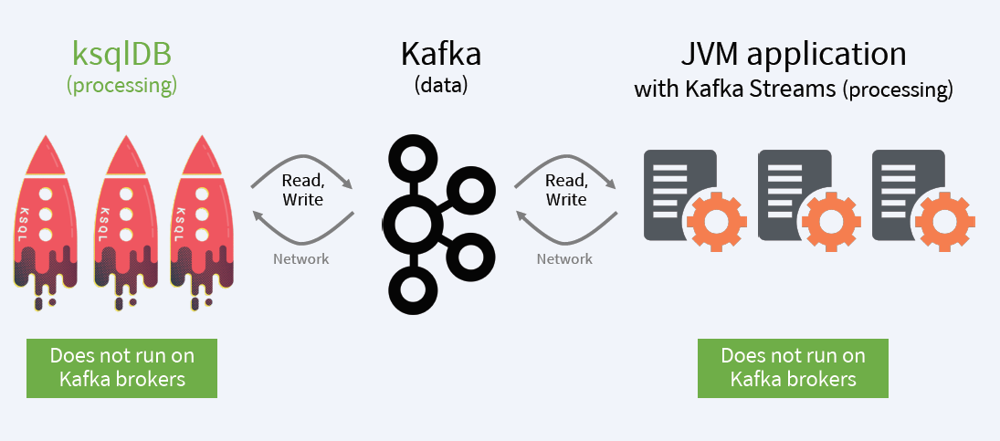

## Realtime Event Stream Processing
- 실시간 이벤트 스트림 데이터 분석 및 처리
- 대용량의 이벤트 스트림 데이터를 실시간으로 분석 및 처리는 요구사항이 다양함

- Database에 저장 후 분석 및 처리하는 것이 아니라, Kafka에 있는 움직이는 데이터(Data in Motion)를  바로 분석 및 처리하는 것이 핵심

- 실시간 이벤트 스트림을 실시간으로 분석하여, 실시간으로 빠르게 대응하기 위한 기술

https://www.confluent.io/blog/how-real-time-materialized-views-work-with-ksqldb/

## 기존에 사용하던 Realtime Event Stream Processing
Apache Spark, Storm, Flink

## Kafka 진영에서 나온 Realtime Event Stream Processing 방법들
 - Kafka Streams
    - Event Streaming용 Library(Java, Scala)
    - Framework이 아님 - 별도의 Cluster 구축이 불필요
    - application.id로 KStreams Application을 grouping
    - groupBy, count, filter, join, aggregate 등 손쉬운 스트림 프로세싱 API 제공
 - ksqlDB
    - Event Streaming Database(또는 SQL 엔진) - RDBMS/NoSQL DB가 아님
    - 간단한 Cluster 구축 방법 - 동일한 ksql.service.id로 ksqlDB를 여려 개 기동
    - 여러 개의 Cluster는 ksql.service.id 값을 서로 다르게 하기만 하면됨
    - SQL과 유사한 형태로 ksqlDB에 명령어를 전송하여 스트림 프로세싱 수행

## Kafka Pub/Sub vs Kafka Streams vs ksqlDB

## ksqlDB vs Kafka Streams
- SQL 개발 vs Java Application 개발
1. ksqlDB: SQL을 사용하여 실시간 이벤트  스트리밍 처리용, 애플리케이션을 작성하기 위한  Apache Kafka  스트리밍 DB(SQL엔진)
2. Kafka Streams: Java 및 Scala로 실시간 이벤트 스트리밍 처리용. 애플리케이션 및 마이크로 서비스를 작성하기 위한 Apache Kafka Streams 라이브러리

## Kafka와 상호작용 구조
- Broker와 별개로 구성

-Data Flow

- 개발 방식 및 배포 방식

