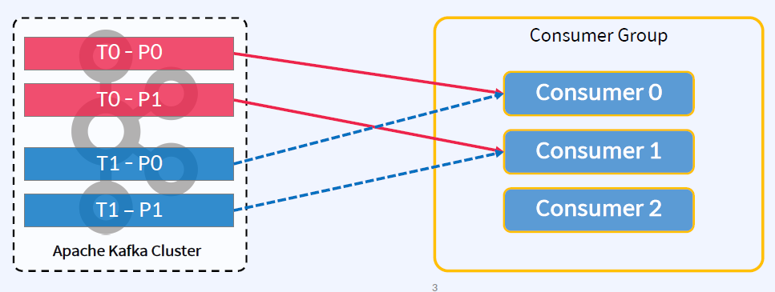
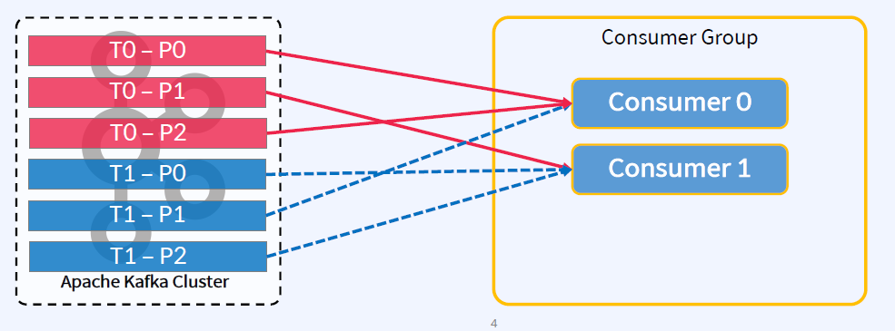
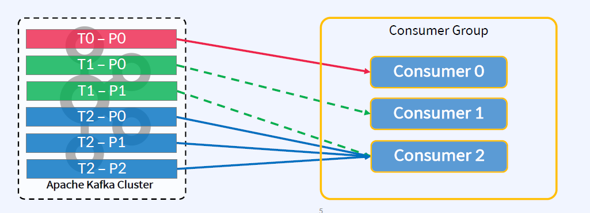
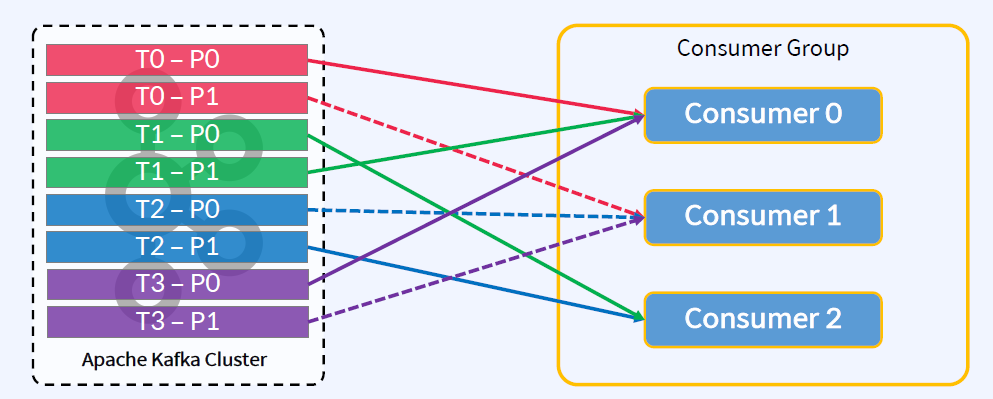
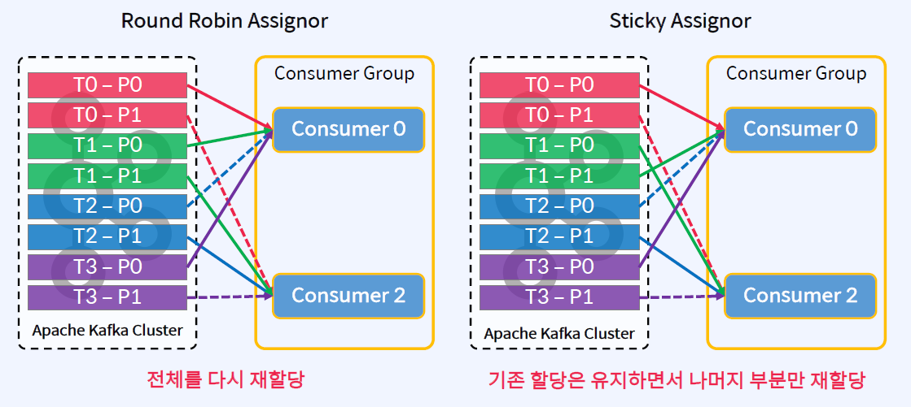
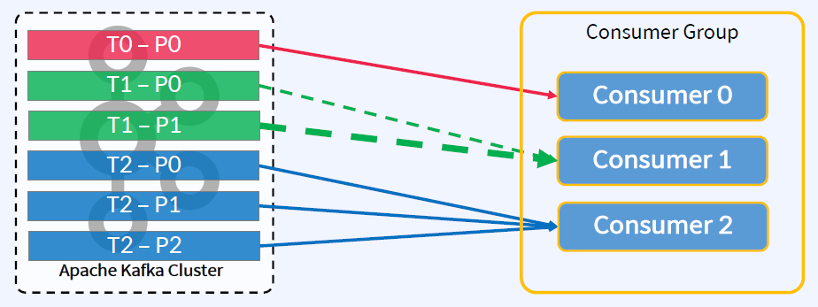
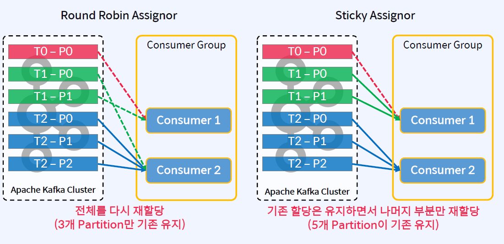

## Partition Assignment Strategy
Range, RoundRobin, Sticky, CooperativeSticky, Custom
- org.apache.kafka.clients.consumer.RangeAssignor
    - Topic별로 작동하는 Default Assignor
- org.apache.kafka.clients.consumer.RoundRobinAssignor
    - Round Robin방식으로 Consumer에게 Partition을 할당
- org.apache.kafka.clients.consumer.StickyAssignor
    - 최대한 많은 기존 Partition 할당을 유지하면서 최대 균형을 이루는 할당을 보장
- org.apache.kafka.clients.consumer.CooperativeStickyAssignor
    - 동일한 StickyAssignor 논리를 따르지만 협력적인 Rebalance을 허용
- org.apache.kafka.clients.consumer.ConsumerPartitionAssignor 인터페이스를
구현하면 사용자 지정 할당 전략을 사용할 수 있음

## Range Assignor
- partition.assignment.strategy 파라미터의 Default Assignor
    - 동일한 Key를 가지고 있는 메시지들에 대한 Topic들 간에 "co-partitioning" 하기 유리
    - 예) Delivery ID를 key로 가지고 있는 delivery_status 메시지와 delivery_location 메시지

Topic의 Partition 개수가 동일한 경우, Co-partitioning 가능

## Round Robin Assignor
- Range 방식보다 효율적으로 분배하여 할당
- Round Robin 방식으로 Partition들과 Consumer들을 분배하여 할당
    - Reassign(재할당) 후 Consumer가 동일한 Partition을 유지한다고 보장하지 않음
    - 예) Consumer 0이 지금 Topic0의 Partition0에 할당되어 있지만, 재할당이 발생하면 Topic0의 Partition0이 다른 Consumer에게 할당될 수 있음

- Consumer 간 Subscribe 해오는 Topic이 다른 경우, 할당 불균형이 발생할 가능성이 있음
    - 3개의 Consumer C0, C1, C2와 3개의 Topic T0, T1, T2를 가정
    - T0은 Partition 1개, T1는 Partition 2개, T2은 Partition 3개를 가정
    - C0은T0만, C1는 T0 과T1만, C2은T0, T1 및 T2를 Subscribe 한다고 가정

## Sticky Assignor
- Range 방식보다 Rebalancing 오버헤드를 줄임
1. 가능한한 균형적으로 할당을 보장
    - Consumer들에게 할당된 Topic Partition의 수는 최대 1만큼 다름
    - 특정 Consumer(예, Consumer A)가 다른 Consumer들(예, Consumer B)에 비해 2개 이상 더 적은 Topic Partition이 할당된 경우, A에 할당된 Topic의 나머지 Partition들은 B에 할당될 수 없음
2. 재할당이 발생했을 때, 기존 할당을 최대한 많이 보존하여 유지
    - Topic Partition이 하나의 Consumer에서 다른 Consumer로 이동할 때의 오버헤드를 줄임

- 3개의 Consumer C0, C1, C2와 4개의 Topic T0, T1, T2, T3를 가정
- T0, T1, T2, T3는 모두 Partition 2개를 가정
- C0, C1, C2 모두 T0, T1, T2, T3를 Subscribe 한다고 가정

- C1이 제거되고 재할당이 발생한다고 가정

- Round Robin 방식에서 설명했던 할당 불균형이 발생했던 시나리오는 아래와 같음
    - 3개의 Consumer C0, C1, C2와 3개의 Topic T0, T1, T2를가정
    - T0은 Partition 1개, T1는 Partition 2개, T2은 Partition 3개를 가정
    - C0은 T0만, C1는 T0과 T1만, C2은 T0, T1 및 T2를 Subscribe한다고 가정

- Sticky: 특정 Consumer(예, Consumer A)가 다른 Consumer들(예, Consumer B)에 비해 2개 이상 더 적은 Topic Partition이 할당된 경우, A에 할당된 Topic의 나머지 Partition들은 B에 할당될 수 없음

- Consumer 0이 제거되고 재할당이 발생한다고 가정

Q) 왜 T2의 Partition들이 하나의 Consumer에게 몰리는건지?
