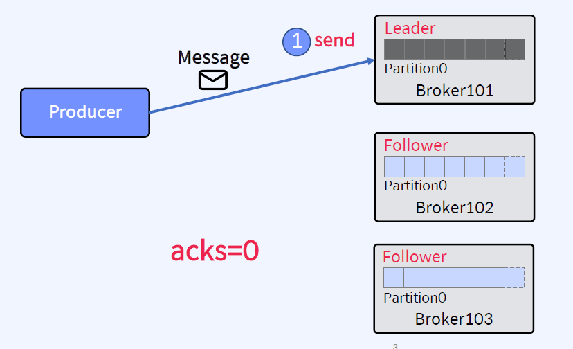
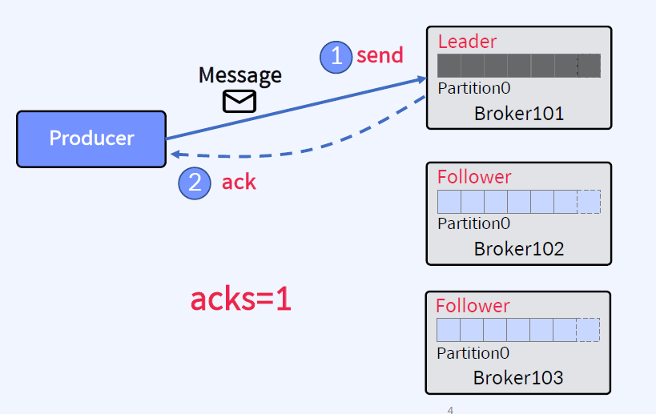
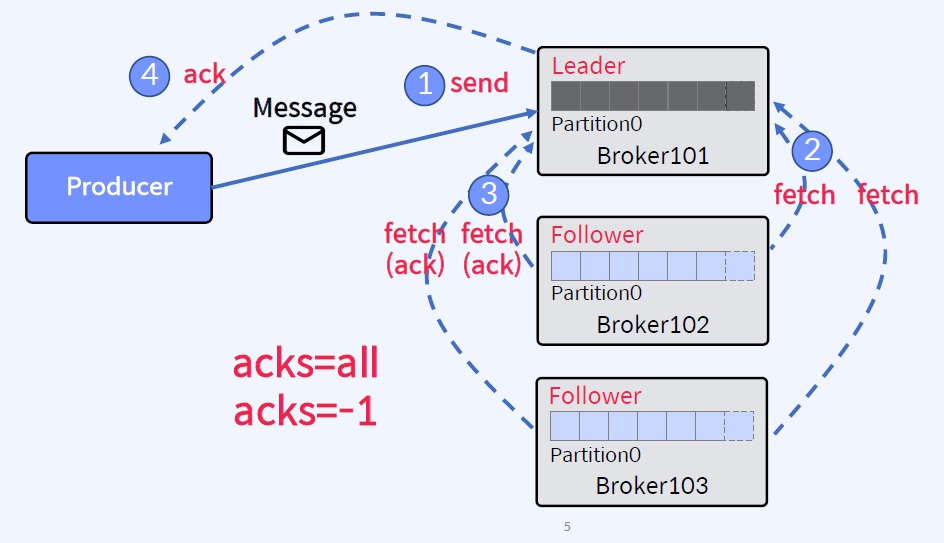
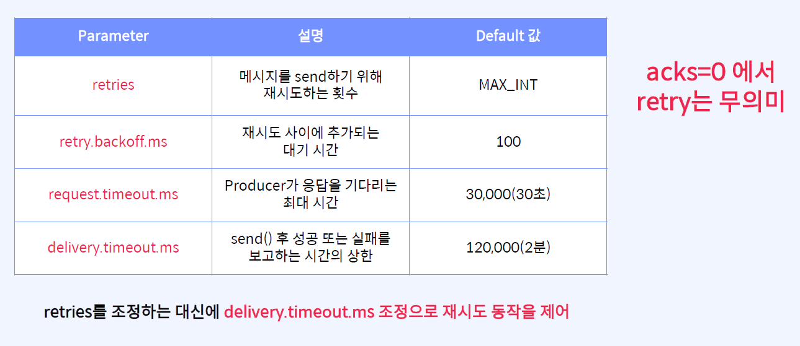
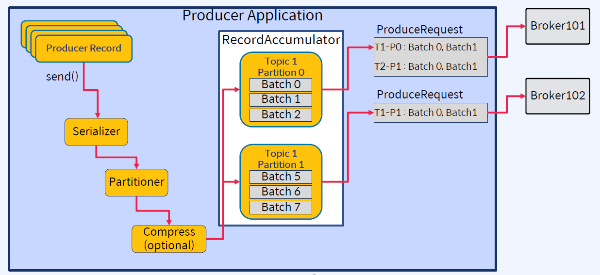
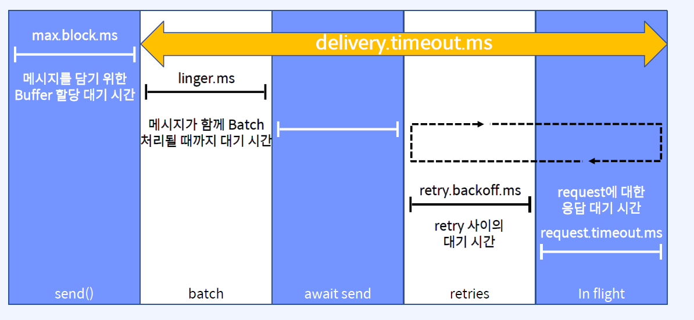
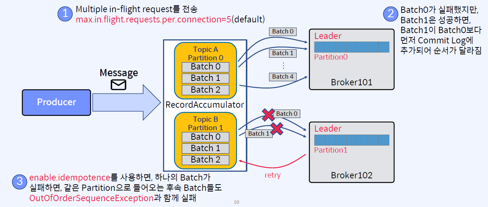
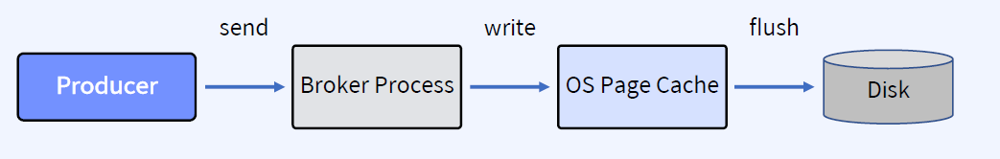

## Producer Acks
Producer Parameter 중 하나
acks 설정은 요청이 성공할 때를 정의하는 데 사용되는 Producer에 설정하는 Parameter
1. acks=0: ack가 필요하지 않음. 이 수준은 자주 사용되지 않음. 메시지 손실이 다소 있더라도 빠르게 메시지를 보내야 하는 경우에 사용

2. acks=1: (default) Leader가 메시지를 수신하면 ack를 보냄. Leader가 Producer에게 ACK를 보낸 후, Follower가 복제하기 전에 Leader에 장애가 발생하면 메시지가 손실. "At most once(최대 한 번)" 전송을 보장

3. acks=1, acks=all: 메시지가 Leader가 모든 Replica까지 Commit 되면 ack를 보냄. Leader를 잃어도 데이터가 살아남을 수 있도록 보장. 그러나 대기 시간이 더 길고 특정 실패 사례에서 반복되는 데이터 발생 가능성이 있음. "At least once(최소 한 번)" 전송을 보장

## Producer Retry
재전송을 위한 Parameters
- 재시도(retry)는 네트워크 또는 시스템의 일시적인 오류를 보완하기 위해 모든 환경에서 중요

## Producer Batch 처리
1. 메시지를 모아서 한번에 전송
- Batch 처리는 RPC(Remote Procedure Call) 수를 줄여서 Broker가 처리하는 작업이 줄어들기 때문에 더 나은 처리량을 제공

2. linger.ms & batch.size

linger.ms(default: 0, 즉시 보냄): 메시지가 함께 Batch 처리될 때까지 대기 시간
batch.size(default: 16KB): 보내기 전 Batch의 최대 크기

보통 Batch.size가 아닌 linger.ms로 컨트롤 함

Batch처리의 일반적인 설정은 linger.ms=100 & batch.size=1000000

## Producer Delivery Timeout
Send() 후 성공 또는 실패를 보고하는 시간의 상한

## Message Send 순서 보장
enable.idempotence
- 진행 중(in-flight)인 여러 요청(request)을 재시도하면 순서가 변경될 수 있음
- 메시지 순서를 보장하려면 Producer에서 enable.idempotence를 true로 설정

## Page Cache와 Flush
- 메시지는 Partition에 기록됨
- Partition은 Log Segment file로 구성(기본값: 1GB마다 새로운 Segment 생성)
- 성능을 위해 Log Segment는 OS Page Cache에 기록
- 로그 파일에 저장된 메시지의 데이터 형식은 Broker가 Pruducer로부터  수신한 것, 그리고 Consumer에게 보내는 것과 정확히 동일하므로, Zero-Copy가 가능
- Page Cache는 다음과 같은 경우 디스크로 Flush됨
    - Broker가 완전히 종료
    - OS background "Flusher Thread" 실행

Zero-copy 전송은 데이터가, User Space에 복사되지 않고, CPU 개입 없이 Page Cache와 Network Buffer 사이에서 직접 전송되는 것을 의미. 이것을 통해  Broker Heap 메모리를 절약하고 또한 엄청난 처리량을 제공

## Flush 되기 전에 Broker 장애가 발생하면?
이를 대비하기 위해서 Replication을 하는 것
- OS가 데이터를 디스크로 Flush하기 전에 Broker의 시스템에 장애가 발생하면 해당 데이터가 손실됨
- Partition이 Replication되어 있다면, Broker가 다시 온라인 상태가 되면 필요시 Leader Replica에서 데이터가 복구됨
- Replication이 없다면, 데이터는 영구적으로 손실될 수 있음

## Kafka 자체 Flush 정책
- 마지막 Flush 이후의 메시지 수(log.flush.interval.messages)으로 Flush(fsync)를 트리거하도록 설정할 수 있음
- Kafka는 운영 체제의 background Flush 기능(ex)pdflush)을 더 효율적으로 허용하는 것을 선호하기 때문에 이러한 설정은 기본적으로 무한(기본적으로  fsync 비활성화)으로 설정
- 이러한 설정을 기본값으로 유지하는 것을 권장
- *.log 파일을 보면 디스크로 flush된 데이터와 아직 flush되지 않은 Page Cache(OS Buffer)에 있는 데이터가 모두 표시됨
- Flush된 항목과 Flush되지 않은 항목을 표시하는 Linux 도구(ex)vmtouch)도 있음

## Summary
Acks, Batch, Idempotence, Page Cache
- Producer ACks: 0, 1, all(-1)
- Batch 처리를 위한 옵션: linger.ms, batch.size
- 메시지 순서를 보장하려면 Producer에서 enable.idempotence를 true로 설정
- 성능을 위해 Log Segment는 OS Page Cache에 기록됨