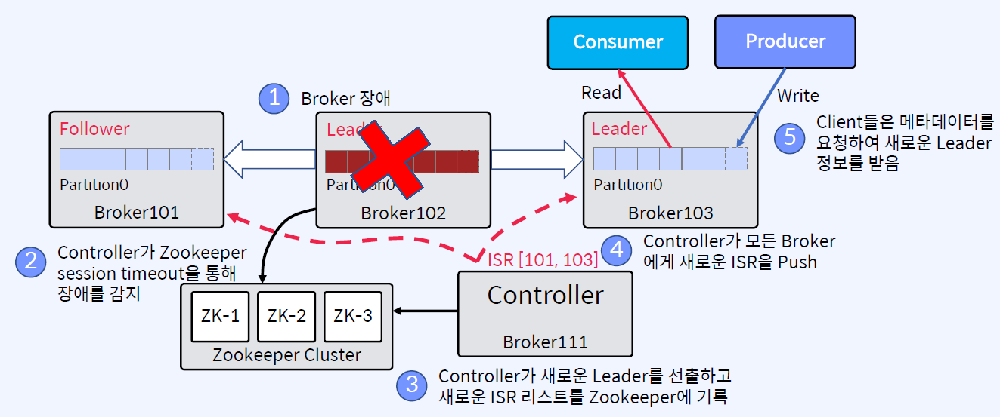

## In-Sync Replicas
Leader가 관리
- 메시지가 ISR리스트의 모든 Replica에서 수신되면 Commit된 것으로 간주
Kafka Cluster의 Controller가 모니터링하는 Zookeeper의 ISR 리스트에 대한 변경 사항은 Leader가 유지
- n개의 Replica가 있는 경우 n-1개의 장애를 허용할 수 있음
- Follower가 실패하는 경우
    - Leader에 의해 ISR 리스트에서 삭제됨
    - Leader는 새로운 ISR을 사용하여 Commit함
- Leader가 실패하는 경우
    - Controller는 Follower 중 새로운 Leader를 선출
    - Controller는 새 Leader와 ISR정보를 먼저 Zookeeper에 Push한 다음 로컬 캐시을 위해 Broker에 Push함

## ISR은 리더가 관리
Zookeeper에 ISR 업데이트, Controller가 Zookeeper로부터 수신
1. Follower가 너무 느리면 Leader는 ISR에서 Follower를 제거하고 Zookeeper에 ISR을 유지
2. Controller는 Partition Metadata에 대한 변경 사항에 대해서 Zookeeper로부터 수신 

## Leader Failure
- Controller가 새로운 Leader 선출
- Zookeeper가 장애를 탐지
- Controller가 새로 선출한 Leader 및 ISR정보는 Controller 장애로부터 보호하기 위해, Zookeeper에 기록한 다음 클라이언트 메타데이터 업데이트를 위해 모든 Broker에 전파

## Broker Failure
Broker 4대, Partition 4, Replication Factor가 3일 경우를 가정
- Partition 생성시 Broker들 사이에서 Partition들이 분산되어 배치됨

- Partition Leader가 없으면, Leader가 선출될 때까지 해당 Partition을 사용할 수 없게 됨
- Producer의 send()는 retries 파라미터가 설정되어 있으면 재시도함
- 만약 retries=0이면, NetworkException이 발생

## Summary
- Follower가 실패하는 경우, Leader에 의해 ISR 리스트에서 삭제되고, Leader는 새로운 ISR을 사용하여 Commit함
- Leader가 실패하는 경우, Controller는 Follower 중에서 새로운 Leader를 선출하고, Controller는 새 Leader와 ISR정보를 먼저 Zookeeper에 Push한 다음 로컬 캐싱을 위해 Broker에 Push
- Leader가 선출될 때까지 해당 Partition을 사용할 수 없게 됨