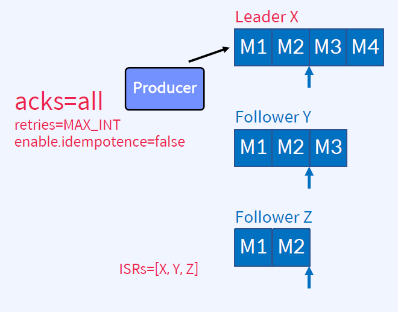
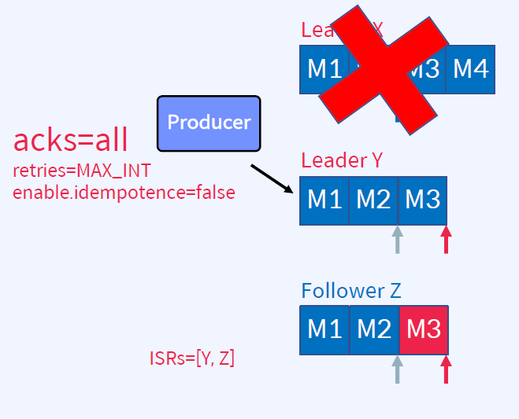
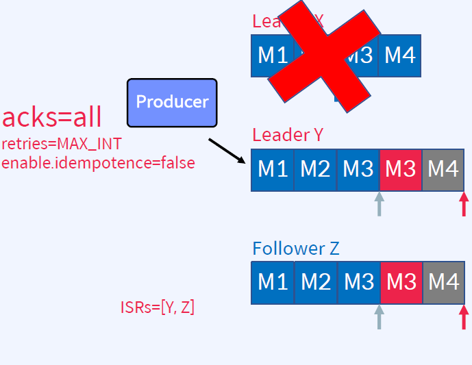
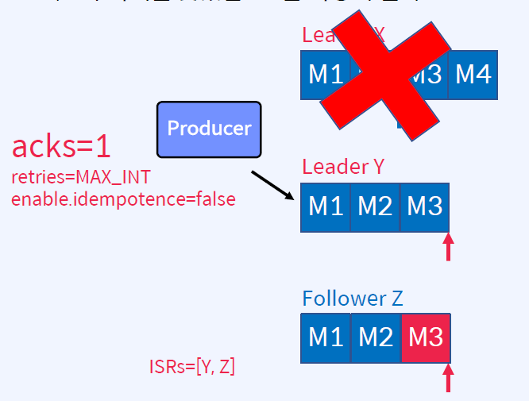
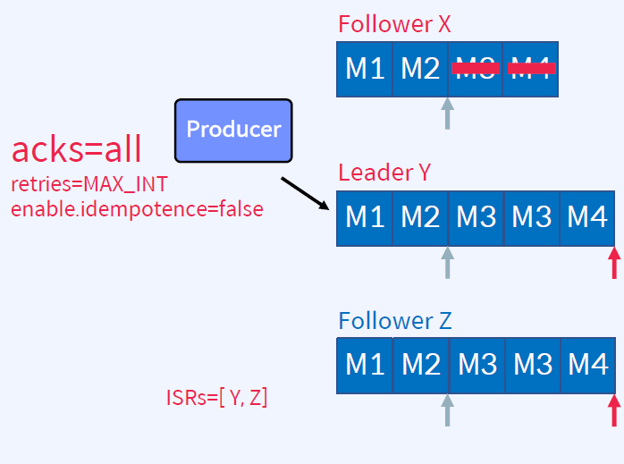
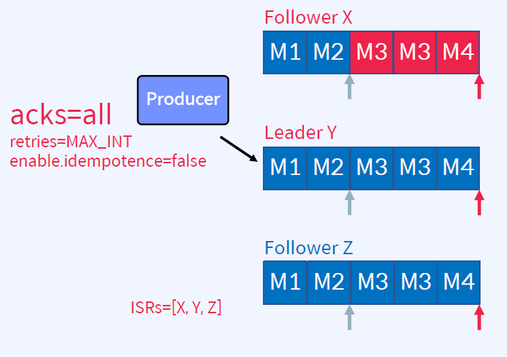

## Broker Recovery
acks=all의 중요성
- 3개의 Replica로 구성된 하나의 Partition
- Producer가 4개의 메시지를 보냈음
1. 메시지 M1, M2가 ISR 리스트 전체에 복제되었고 Commit 되었음
2. Y는 M3을 복제했지만 Commit은 못한 상태
3. Z는 M2까지만 복제했음

- Broker X가 장애나면 새로운 Leader가 선출됨
- Controller가 Y를 Leader로 선출했다고 가정
4. M3, M4를 Commit하기전에 Broker X장애 발생
5. Y가 Leader로 선출
6. Leader Epoch가 0에서 1로 증가
7. Z는 M3를 fetch함
8. Y는 High Water Mark를 진행
9. Z는 fetch 다시 수행하고 High Water Mark를 수신하고 진행

Q) M3는 Commit 된 적이 없는데 왜 Y는 M3를 가지고 있을 수 있는가?

- Broker X는 M3, M4에 대한 ack를 Producer에게 보내지 못했음
- Producer는 재시도에 의해 M3, M4를 다시 보냄
10. Producer는 M3, M4에 대한 ack 미수신 M3, M4를 Y로 송신 재시도
11. idempotence=false이므로 M3는 중복 발생
12. Z는 M3(중복), M4를 fetch함
13. Z는 fetch 다시 수행하고 High Water Mark를 수신하고 진행

- 만약 acks=1이었다면?
1. Leader X가 장애나기 전에 Producer는 M4에 대한 ack를 수신 --> Producer가 M4 송신을 재시도하지 않게 되므로, M4는 영원히 잃어버리는 결과를 초래 [at most once]
2. Y가 Leader로 선출
3. Leader Epoch가 0에서 1로 증가
4. Z는 M3를 fetch함
5. Y는 High Water Mark를 진행
6. Z는 fetch 다시 수행하고 High Water Mark를 수신하고 진행

- 장애가 발생됬던 X가 복구되면?
X는 Follower가 되어서 Y로부터 복제함
1. X가 복구되면 Zookeeper에 연결
2. X는 Controller로부터 metadata를 받음
3. X는 Leader Y로부터 Leader Epoch를 fetch
4. X는 Leadership이 변경된 시점부터 Truncate

5. X는 Leader Y로부터 복제
6. 복제가 한번 일어나면, ISR 리스트에 복귀

## Availability & Durability
가용성과 내구성 중 선택 ?
- Topic 파라미터 - unclean.leader.election.enable
    - ISR 리스트에 없는 Replic를 Leader로 선출할 것인지에 대한 옵션(default: false)
    - ISR 리스트에 Replica가 하나도 없으면 Leader 선출을 안 함 - 서비스 중단
    - ISR 리스트에 없는 Replica를 Leader로 선출함 - 데이터 유실
- Topic 파라미터 - min.insync.replicas
    - 최소 요구되는 ISR의 개수에 대한 옵션(default: 1)
    - ISR이 min.insync.replicas 보다 적은 경우, Producer는 NotEnoughReplicas 예외를 수신
    - Producer에서 acks=all과 함께 사용할 때 더 강력한 보장 + min.insync.replicas=2
    - n개의 Replica가 있고, min.insync.replicas=2인 경우 n-2개의 장애를 허용할 수 있음
- 데이터 유실이 없게 하려면?
    - Topic: replication.factor는 2보다 커야함(최소 3이상)
    - Producer: acks는 all이어야 함
    - Topic: min.insync.replicas는 1보다 커야 함(최소 2이상)
- 데이터 유실이 다소 있더라도 가용성을 높게 하려면?
    - Topic: unclean.leader.election.enable를 true로 설정

## Summary
가용성과 내구성 관련 파라미터
- replication.factor
- acks
- min.insync.replicas
- unclean.leader.election.enable

